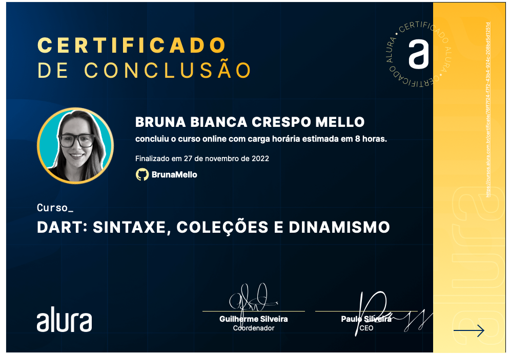

<h1>Dart</h1>

<h5>Dart is a programming language optimized for the client, as it allows you to develop fast applications on any platform.
This language offers more productivity during cross-platform development, combined with a flexibility that allows you to create both web applications and mobile applications with Flutter, for example.
In this training, you will learn more about Dart and learn:</h5>
- Discover the advantages and disadvantages of using Dart in your projects;
- Install and use the tools;
- Know what are variables, lists, repetition loops and good language practices;
- Learn how the object orientation paradigm applies to Dart;
- Better understand the questions of syntax and dynamism in the programming language;
- Know the exceptions and how to deal with them;
- Learn about timing in Dart and much more!

<h5>At the end of this training, you will be able to develop an application with Dart and implement functionalities, applying various techniques and understanding the fundamentals of this language.
Good studies!</h5>

Certificate: "https://cursos.alura.com.br/certificate/76ff7f24-f7f2-43b4-924c-208bd5d1251d"

